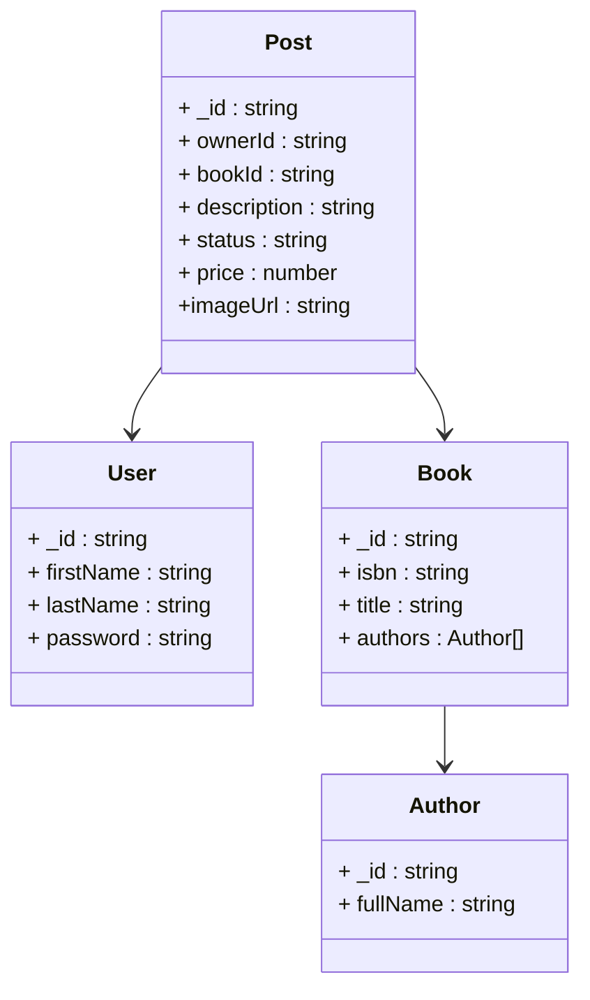

@startuml
skinparam classAttributeIconSize 0

class Usuario {
  +id : ObjectId
  +posts : ObjectId[]
}

class Post {
  +id : ObjectId
  +usuarioId : ObjectId
  +libroId : ObjectId
  +estado : EstadoPost
  +venta : boolean
  +precio : decimal
  +descripcion : string
  +fechaCreacion : Date
}

class Libro {
  +id : ObjectId
  +titulo : string
  +isbn : string
  +genero : string
  +editorial : string
  +anioPublicacion : int
  +idioma : string
  +numeroPaginas : int
  +autores : ObjectId[]
}

class Autor {
  +id : ObjectId
  +nombre : string
}

enum EstadoPost {
  BORRADOR
  PUBLICADO
  PAUSADO
  VENDIDO
  ELIMINADO
}

Usuario "1" --> "0..*" Post : tiene
Post "0..*" --> "1" Usuario : pertenece a
Post "0..*" --> "1" Libro : referencia
Libro "1" --> "0..*" Autor : escrito por
@enduml
